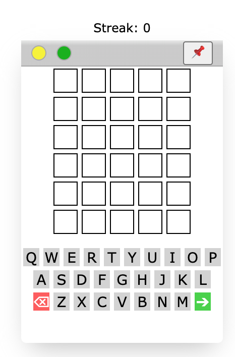

# boredle - a small script to play Wordle anywhere on the web

## How to use:

- Copy and paste either boredle.js or bordle.min.js into your browser's console
- Use the tampermonkey chrome extension to run the script on every page (or specific pages using @match) using the boredle-tampermonkey.js file

## Features:

- Increase size with green window button
- Decrease size with yellow window button
- Pin in place with the pin 📌 button, click again to float in bottom right corner
