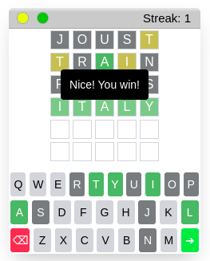

# boredle - a small script to play Wordle anywhere on the web

## How it works

The script pulls all 5 letter words from any webpage and uses them for a game of Wordle. Use on text-heavy sites like wikipedia using tampermonkey's @match feature. Example: @match https://en.wikipedia.org/*

## How to use:

Two ways to play:

- Copy and paste either boredle.js or bordle.min.js into your browser's console
- Use the [tampermonkey chrome extension](https://chrome.google.com/webstore/detail/tampermonkey/dhdgffkkebhmkfjojejmpbldmpobfkfo) to run the script on every page using @match https://*

## Future features

- Use of word-bank (want to avoid calling additional resources, but hardcoding would increase the size of the program tremendously)
- Share feature
